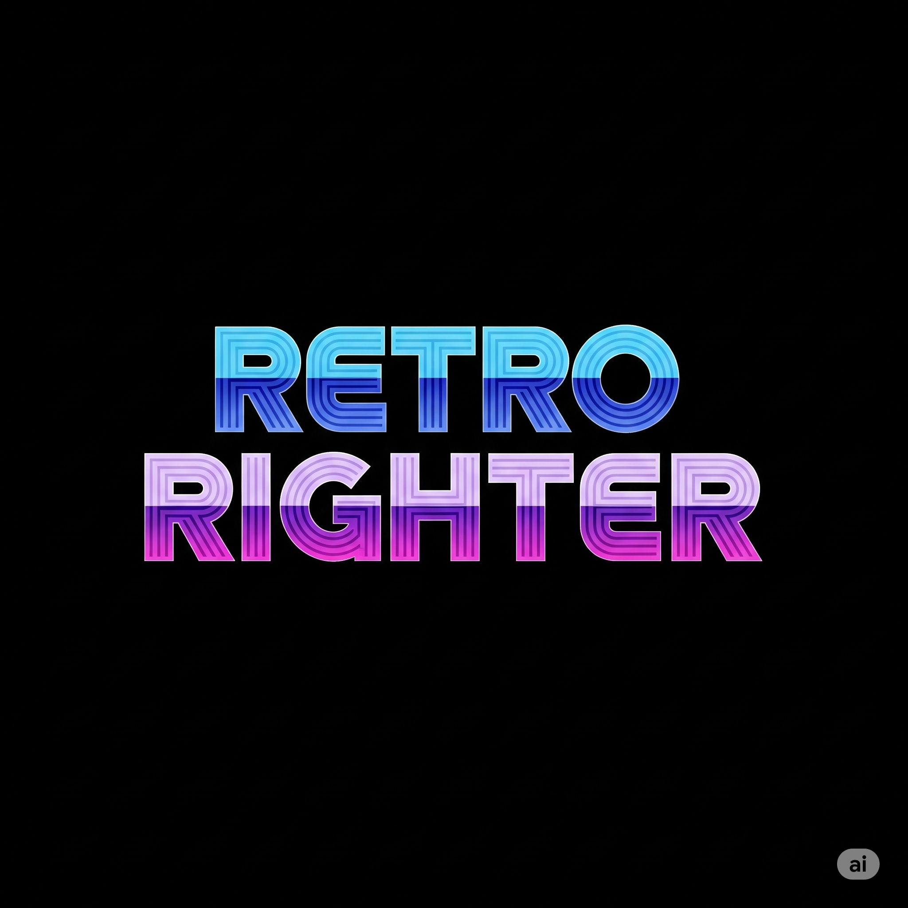
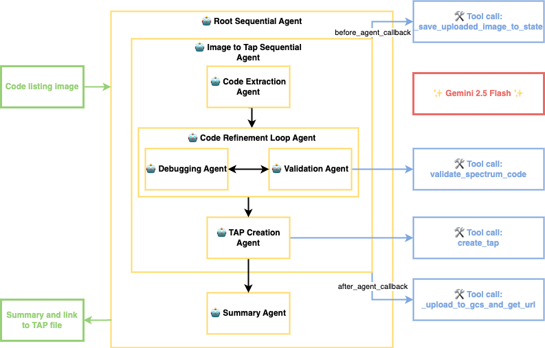

# Retro Righter



## Getting Started

### Setup Environment

Follow these steps to set it up a Python virtual environment

```bash
# Create virtual environment in the root directory
python -m venv .venv

# Activate (each new terminal)
# macOS/Linux:
source .venv/bin/activate
# Windows CMD:
.venv\Scripts\activate.bat
# Windows PowerShell:
.venv\Scripts\Activate.ps1
```

### Setting Up API Keys

1. Go to the Google Cloud console https://console.cloud.google.com/
2. Create a new project
3. Go to https://aistudio.google.com/apikey
4. Create an API key
5. Assign key to the project
6. Connect to a billing account

The src/app folder contains a `.env.example` file.

1. Navigate to the src/app folder
2. Rename `.env.example` to `.env`
3. Open the `.env` file and replace the placeholder with your API key:
   ```
   GOOGLE_API_KEY=your_api_key_here
   ```

## Project Structure

This project is organised as follows:

```
src/
├── app/                 # Core application code
│   ├── agent.py         # Root agent logic
│   ├── sub_agents  
│   │   ├── code_extraction_agent
│   │   ├── debugging_agent
│   │   ├── summary_agent
│   │   ├── tap_creation_agent
│   │   └── validation_agent
│   ├── server.py        # FastAPI Backend server
│   └── utils/           # Utility functions and helpers
├── deployment/          # Infrastructure and deployment scripts
├── docs/                # Documentation
├── scripts/             # Testing and verification scripts
├── static/              # UI
├── tests/               # Unit, integration, and load tests
├── Dockerfile           # Dockerfile to use for Cloud Run container
├── Makefile             # Makefile for common commands
└── pyproject.toml       # Project dependencies and configuration
```

## Architecture



## Requirements

Before you begin, ensure you have:

- **uv**: Python package manager - [Install](https://docs.astral.sh/uv/getting-started/installation/)
- **Google Cloud SDK**: For GCP services - [Install](https://cloud.google.com/sdk/docs/install)
- **Terraform**: For infrastructure deployment - [Install](https://developer.hashicorp.com/terraform/downloads)
- **make**: Build automation tool - [Install](https://www.gnu.org/software/make/) (pre-installed on most Unix-based
  systems)

## Quick Start (Local Testing)

Install required packages and launch the local development environment:

```bash
make install && make playground
```

## Commands

| Command              | Description                                                                                    |
|----------------------|------------------------------------------------------------------------------------------------|
| `make install`       | Install all required dependencies using uv                                                     |
| `make playground`    | Launch local development environment with backend and frontend - leveraging `adk web` command. |
| `make backend`       | Deploy agent to Cloud Run                                                                      |
| `make local-backend` | Launch local development server                                                                |
| `make test`          | Run unit and integration tests                                                                 |
| `make lint`          | Run code quality checks (codespell, ruff, mypy)                                                |
| `make setup-dev-env` | Set up development environment resources using Terraform                                       |
| `uv run jupyter lab` | Launch Jupyter notebook                                                                        |

For full command options and usage, refer to the [Makefile](Makefile).

### Dev Environment

You can test deployment towards a Dev Environment using the following command:

```bash
gcloud config set project <your-dev-project-id>
make backend
```

