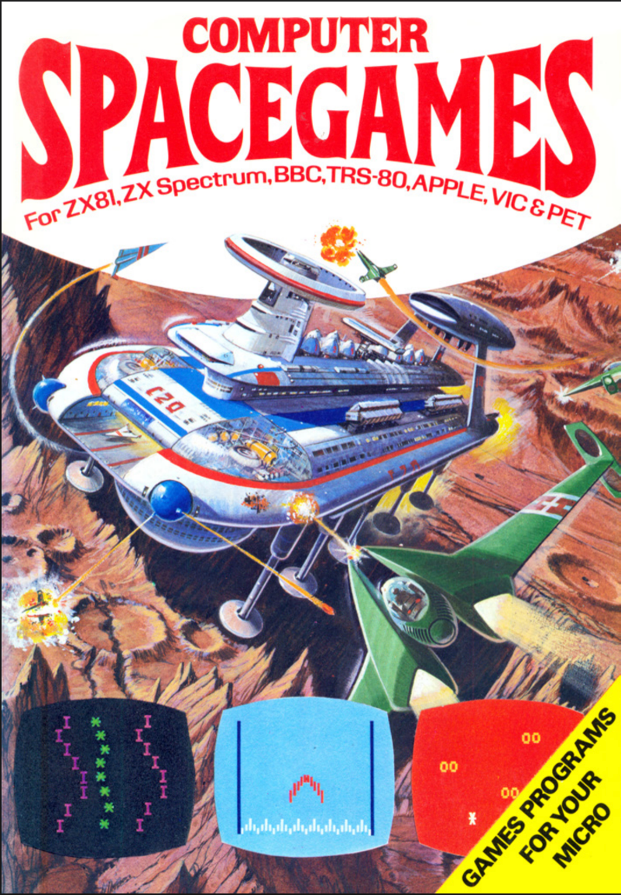

# Demo

I first started programming on the ZX Spectrum in the 1980s.

I would take books like this one from Usborne out of the library:

In them where code listings that I would slowly type in, often with my dad reading them out, an early form of pair programming if you like.

The trouble is these listings were not perfect and often had errors. I could get frustrated typing the code in exactly as it was in the book only to find it did not run.

Sometimes the programs were also a bit disappointing not living up to the fancy artwork.

What would have been useful is a system that automated the process of going from listing in a book to working programme. That way, readers like me to know that if they followed the code exactly they would end up with a working application. 

This is what I set out to build, an automation of the complex process of getting a listings from Usborne books running successfully on a ZX Spectrum.

When testing, I accidentally sent the prompt "say hello" and it created a valid spectrum programme 

`10 PRINT "hello"`

Could I actually "vibe code" spectrum games. I tried "Write spectrum implementation of the game of life"

It may seem a tricial example but I see ADK and similar agentic tools as a great way to automate business processes and many will have an element of taking paper and validating the content.

## References

* [Computer Space Games](https://drive.google.com/file/d/0Bxv0SsvibDMTNlMwTi1PTlVxc2M/view?resourcekey=0-kaU6eyAmIVhT3_H8RkHfHA)