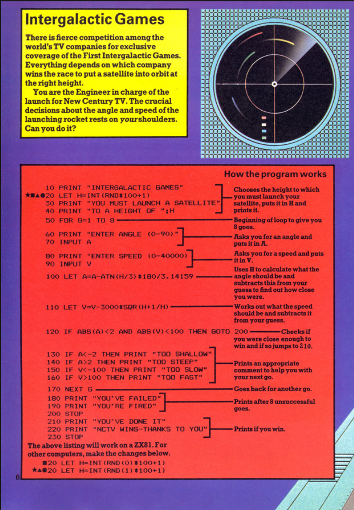

# Agentic Testing and Fixing Spectrum Code Listings with Google ADK

My first computer was a ZX Spectrum and not an ordinary Spectrum, a Spectrum 128K like this:

My first experience at programming involed going to a library and taking out a book like this:

These books contained code listings with explanations of how the code functioned. I would painstakingly type the listings in often with my dad reading them out in an early form of pair programming.

However, there was a problem. Often the code listings would contain errors. For example, in this listing, line 80 is missing the closing quotes. Typing the listing in faithfully only to not have it worked was very frustrating.

What would have been great is if the publisher had a way of verifying that the listings in the book were correct before going to print. Now 40 years later, I thought I would attempt build an multi-agent system to do just that using Google Agent Development Kit (ADK).

## UI

I am not too up to date with UI technologies, so I got Windsurf and Gemini to help me out with a reasonable looking frontend.

## Hosting

I think Google Cloud Run is an excellent product, an efficient and easy way to running containerised applications, so it was idea for this too.

## Observations

The main observation I have is that the agents can be too helpful:
- Finding GitHub code
- Fixing the code at extraction
- Creating code from the "say hello" prompt in testing