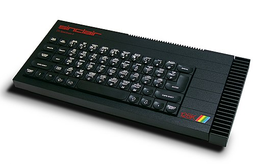
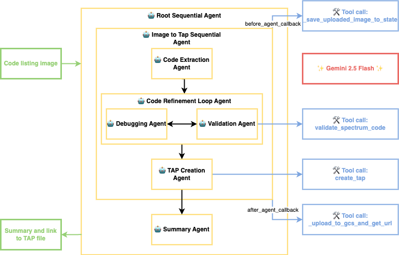

# Agentic Testing and Fixing Spectrum Code Listings with Google ADK

My journey into computing began with a legendary machine: the ZX Spectrum 128K.

My first taste of programming involved frequent trips to the local library and taking out a book like this:

These books contained code listings with explanations of how the code functioned. I would painstakingly type the listings in, often with my dad reading them out in an early form of pair programming.

However, there was a problem. Often, the code listings contained errors. For example, in this listing, line 80 is missing the closing quotes. Typing the listing in faithfully only to not have it work was very frustrating.

What would have been great is if the publisher had a way of verifying that the listings in the book were correct before going to print. Now, 40 years later, I thought I would attempt to build a multi-agent system to do just that using [Google Agent Development Kit](https://google.github.io/adk-docs/) (ADK).

## My Solution

My approach started by mimicking a manual verification process. The first hurdle: extracting the code from an image of the book listing. Fortunately, Gemini's multimodal capabilities proved excellent for this task.

Then, I needed a way to validate the extracted code. I found a free tool called bas2tap. This tool creates tap (tape) files that can be loaded into a Spectrum emulator. However, it also validates the code as part of the conversion process, so I can use that functionality for validation, but also use `bas2tap` to create a tap file when the code is valid to load into an emulator.

Fortunately, Google ADK supports calling tools so I can use `bas2tap` for validation and tap file creation.

For an emulator, [https://zx.researcher.su/en/](https://zx.researcher.su/en/) is an online emulator written in JavaScript that accepts tap files. If I can create a tap file, I can load it into that emulator and run the code.

While Python isn't my usual go-to, I opted for the Python version of the ADK due to its maturity at the time (I am eagerly awaiting a Go version).

I needed to do the following:

* Extract the code listing from an image
* Validate the code
* Debug any issues
* Repeat the validation and debug cycle until all errors are resolved.
* Create a tap file, so I can load the program into a Spectrum emulator

Therefore, it made sense to break the agents down, so they just did one job, so I have:

* `code_extraction_agent` - extract code from an image of a code listing
* `validation_agent` - validate spectrum code using `bas2tap` as a tool 
* `debugging_agent` - take any validation errors and correct the code
* `tap_creation_agent` - create a tap file from the valid code
* `summary_agent` - Create a summary of the code and corrections made and provide a link to the tap file for download.

I wanted the validation and debug cycle to repeat until the code was valid, so I put these inside a LoopAgent. I then put the code_extraction_agent, the loop agent, and the tap_creation agent in a Sequential Agent so there was an Image to Tap pipeline.

All of these agents use [Gemini 2.5 Flash](https://deepmind.google/models/gemini/flash/) as their LLM.

ADK supports callbacks before and after an agent run. I used a `before_agent_callback` to load the image into state before the Image to Tap pipeline starts, and an `after_agent_callback` to upload the generated tap to a Google Cloud Storage bucket and return the URL. 

I then wrapped everything in another Sequential root agent, which called the Image to Tap pipeline. Then, the summary agent produced a summary report to send back to the user along with a link to the uploaded tap file.

All the code for this project is on [GitHub](https://github.com/danielvaughan/retro-righter/).

### Architecture

Here is what the architecture looks like:

## UI

I am not very up to date with UI technologies, so I got Windsurf and Gemini 2.5 Pro to help me build a reasonable-looking front end. I just needed a way to upload images and present the summary report. Google ADK uses the FastAPI framework to wrap the agents in an API, so it was relatively straightforward to provide static files for the UI that calls the API.

## Hosting

Google Cloud Run is an excellent product, an efficient and easy way to run containerised applications, so it was ideal for this too. I packaged both the backend and frontend into the same container using a Dockerfile, deployed it to Cloud Run, and gave my Cloud Run instance a friendly URL.

The application is available at [https://retro-righter.fulfenlabs.io/ui](https://retro-righter.fulfenlabs.io/ui).

## Running

Here is the output of my "Retro Righter" application showing the summary report and the link to the tap file.

I can then take the tap file, load it into my spectrum emulator, and run the code:

## Observations

Even though this project is a bit of fun, it illustrates Google ADK's potential. Many business processes still have an element of taking paper documents, extracting and correcting information, and then processing it. With a multimodal LLM like Gemini this it suddenly becomes cheap and easy to fully automate processes like this in a way that has not been possible before.

What surprised me most is the way Gemini often did more than I expected:

The first example was when I was developing the prompt to extract code from a listing in Vertex AI. I had the Google Search tool turned on. Gemini extracted the code, but it also found the code on GitHub in a project where someone had been rewriting the Spectrum code in Rust. It used the listing there to validate the code it extracted. This was completely unexpected. It does feel that I am giving instructions and providing tools, much like managing a human with initiative rather than traditional programming.

Another example was when I was manually testing the API. Instead of providing an image, I give the text prompt "say hello". This went through the agents as normal and came out as a valid Spectrum tap file with the code `10 PRINT "hello"`, so Spectrum vibe coding may be possible using this agent, but it is not something I have tested further.

It is early days for Google ADK, but it is an interesting technology and a different way of building software, and it will be interesting to see how this area progresses.