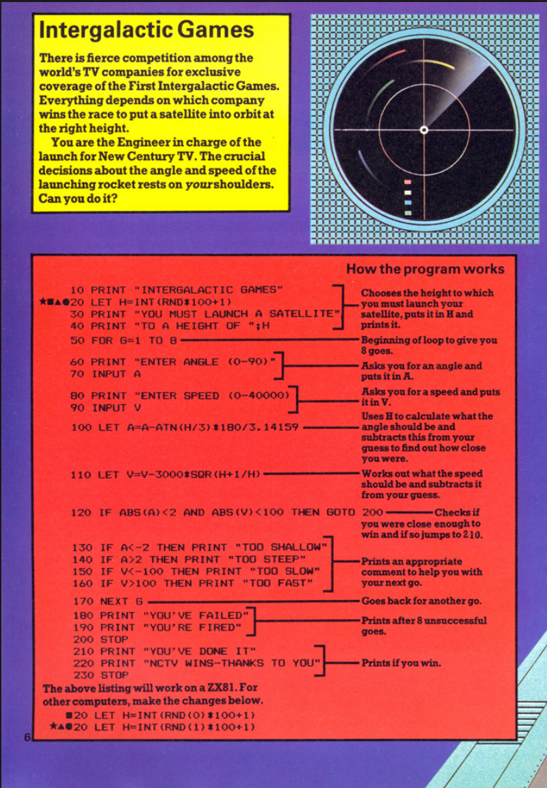

# Demo

## Why

I first started programming on a ZX Spectrum like this:

I would take books like this out of the library:

and type in code listings like this: 

Often my dad would be reading them out, in an early form of pair programming.

## The Problem

The trouble is these listings were not perfect and often had errors. 

I would get frustrated typing the code in exactly as it was in the book only to find it did not run.

What would have been useful is a system that automated the process of going from listing in a book to working programme to verify it was correct. 

That way, readers like me to know that if they followed the code exactly they would end up with a working application. 

## The Solution

This is what I set out to build, an automation of the complex process of getting a listing from Usborne books running successfully on a ZX Spectrum.

## Unexpected Features

When testing, I accidentally sent the prompt "say hello" and it created a valid spectrum programme 

`10 PRINT "hello"`

Could I actually "vibe code" spectrum games? I tried "Write spectrum implementation of the game of life"

## Thoughts

It may seem a trivial example, it is automation of a complex process, and many businesses will have similar dull processes that involve paper forms and manual work and systems like this build with Google ADK could relieve a lot of drudgery and save a lot of money. However submitting a paper tax form validation agent would not have been nearly as fun.

Of course! This is a great foundation with a wonderful, personal story. For a 3-minute demo, the key is to hook the audience, get to the "wow" moment quickly, and then land the business value.

---

### **Title Slide: From Paper to Pixels: Automating a Retro Dream with Google's ADK**

**(0:00 - 0:30) The Hook: A Nostalgic Problem**

"Many of us got our start in coding on machines like this – the ZX Spectrum. We didn’t have the internet; we had library books filled with game listings.

My dad and I would spend hours in an early form of pair programming: he'd read the code, and I would type it in, line by painful line.

The problem? These listings were full of typos. You'd type everything perfectly, hit RUN, and get… nothing. It was incredibly frustrating. I always dreamed of a way to know for sure that the code in the book would actually work."

**(0:30 - 1:15) The Solution: An AI-Powered Verifier**

"Decades later, I decided to build that dream. Using Google's Agent Development Kit (ADK), I created an agent that automates this entire process.

It takes an image of a book page, understands the ZX Spectrum BASIC, and verifies the code.

`[DEMO PART 1: Start screen recording]`
`[Show the agent's UI. Drag and drop the book page image into it.]`

The agent analyzes the listing... flags any potential errors... and produces a clean, verified program file.

`[Show the verified code or a "Success" message]`

Now, we can load this directly into an emulator and see the result we were promised all those years ago.

`[Show the game running successfully in a ZX Spectrum emulator]`

It works! The gap between the paper book and the working program is closed."

**(1:15 - 2:30) The "Wow" Moment: From Verification to Creation**

"But verification was just the start. While building this, I discovered the true power of using a modern AI framework. I wondered, what if the agent could do more than just *read* code? What if it could *write* it from a simple prompt?

`[DEMO PART 2: Switch to a prompt interface in your agent]`

I tried something simple: 'say hello'.

`[Type "say hello" into the prompt. The agent outputs: 10 PRINT "hello"]`

It instantly generated a valid Spectrum program. This wasn't just verification; this was creation. So, I pushed it further.

`[Clear the prompt. Type: "Write a Spectrum implementation of Conway's Game of Life"]`

The agent thinks for a moment... and generates the complete BASIC code for a notoriously complex simulation.

`[Show the generated code for Game of Life. It should look impressive and long.]`

And when we run *this* code...

`[Load the generated Game of Life code into the emulator and show it running]`

...we get a fully working version of the Game of Life, created not from a book, but from a single sentence. This is what I call 'vibe coding'—expressing an intent and having the agent build the reality."

**(2:30 - 3:00) The Bigger Picture & Close**

"While bringing a retro game to life is fun, the principle here is powerful.

Think of any tedious, error-prone manual process in your business—processing invoices, validating forms, migrating data from legacy documents. An agent built with the Google ADK can automate that drudgery, not just by copying the data, but by *understanding the intent* behind it.

It saves time, reduces errors, and frees up people to solve more interesting problems.

From dusty paper to dynamic code, AI agents can unlock the hidden value in your legacy processes.

Thank you."

`[Final slide with your name, contact info, and the link to the book]`

## References

* [Computer Space Games](https://drive.google.com/file/d/0Bxv0SsvibDMTNlMwTi1PTlVxc2M/view?resourcekey=0-kaU6eyAmIVhT3_H8RkHfHA)